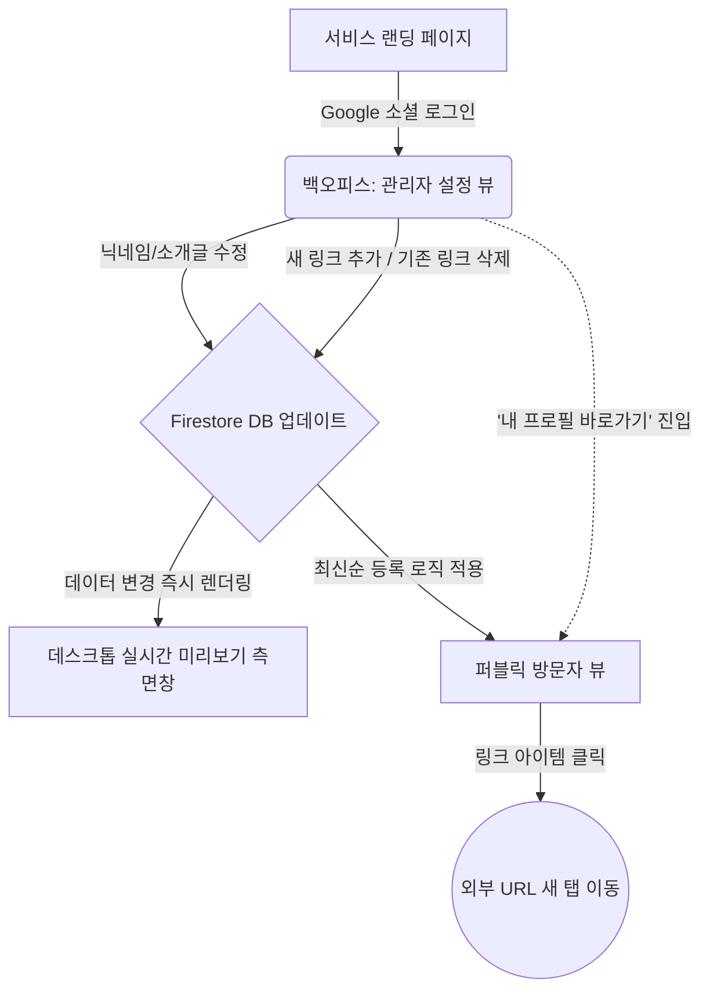

# 📐 마이링크 (MyLink) 와이어프레임 (Wireframe)

현재 문서의 와이어프레임은 PRD 명세에 따라 **'프로필 이미지 없음', '매우 심플한 텍스트 위주 UI'** 기조를 반영했습니다.

## 1. 방문자 뷰 (Public Profile View) - ASCII UI

오직 사용자 닉네임, 한 줄 소개(`bio`), 그리고 추가된 '링크 버튼' 목록으로만 이루어진 단순한 모바일/데스크톱 반응형 뷰입니다.
(가장 나중에 추가된 링크일수록 리스트의 **최상단**에 위치하도록 최신순으로 정렬됩니다.)

```text
+-----------------------------------------+
|                                         |
|                  [ 👤 ]                 |  <-- 별도 이미지 업로드 없는 기본 프로필 아이콘
|               @developer                |  <-- displayName (URL Slug와 동일)
|    "코딩과 디자인을 사랑하는 개발자입니다"   |  <-- bio (한 줄 소개)
|                                         |
|                                         |
|  +-----------------------------------+  |
|  | [🐙]  GitHub Repository       [>] |  |  <-- 가장 최근에 추가된 링크 (최상단)
|  +-----------------------------------+  |
|                                         |
|  +-----------------------------------+  |
|  | [📝]  Tech Blog               [>] |  |  <-- 예전에 추가되었던 링크
|  +-----------------------------------+  |
|                                         |
|  +-----------------------------------+  |
|  | [🎥]  YouTube Channel         [>] |  |  <-- 가장 처음에 추가된 링크 (최하단)
|  +-----------------------------------+  |
|                                         |
|           Powered by MyLink             |
+-----------------------------------------+
```

---

## 2. 관리자 설정 뷰 (Admin/Owner View) - ASCII UI

본인의 프로필 정보를 고치고, 새로운 링크 블록을 추가하거나 수정/삭제하는 공간입니다.

### 2.1 데스크톱(PC) 화면 레이아웃
모니터 화면이 넓은 PC 접속 시, **좌측엔 설정 화면, 우측엔 실시간 폰 미리보기(Preview)** 화면을 띄워 작업 편의성을 극대화합니다.

```text
+---------------------------------------------------------------------------------------+
| MyLink Admin                        [로그아웃] |                                       |
|==============================================|       +-----------------------+       |
| [ 사용자 프로필 설정 ]                         |       |         [ 👤 ]        |       |
| 닉네임: [ developer            ] (/developer)|       |      @developer       |       |
| 소개글: [ 코딩과 디자인을 사랑... ]              |       |  "코딩과 디자인을 ..."  |       |
| [ 프로필 정보 업데이트 ]                       |       |                       |       |
|----------------------------------------------|       | +-------------------+ |       |
| [ 새 링크 추가 ]                               |       | | [🐙] GitHub   [>] | |       |
| 링크 제목: [ 내 깃허브            ]           |       | +-------------------+ |       |
| 이동 URL : [ https://github...  ]            |       | +-------------------+ |       |
| [ + 추가하기 ] (목록 최상단 등록)               |       | | [📝] Tech 블로그[>] | |       |
|----------------------------------------------|       | +-------------------+ |       |
| [ 등록된 링크 관리 (최신순) ]                  |       |                       |       |
| 1. [🐙] GitHub Repository      [수정] [삭제] |       |   Powered by MyLink   |       |
| 2. [📝] Tech Blog              [수정] [삭제] |       +-----------------------+       |
+---------------------------------------------------------------------------------------+
```

### 2.2 모바일 화면 레이아웃
모바일 기기(Phone) 접속 시에는 공간 제약으로 인해 우측 미리보기 영역은 숨겨지고, 좌측의 [설정 변경 메뉴] 영역이 화면 너비(100%)를 차지합니다.

---

## 3. 화면 흐름도 (Screen Flow) - Mermaid Diagram

화면 간의 이동 구조 및 데이터 연동, 실시간 렌더링 과정을 나타냅니다.


